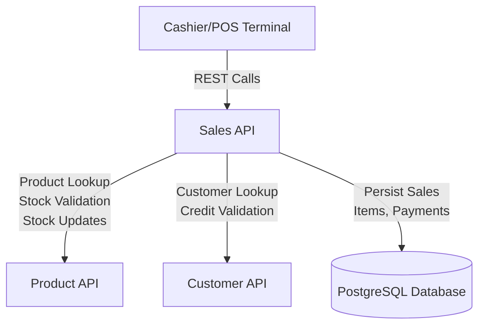
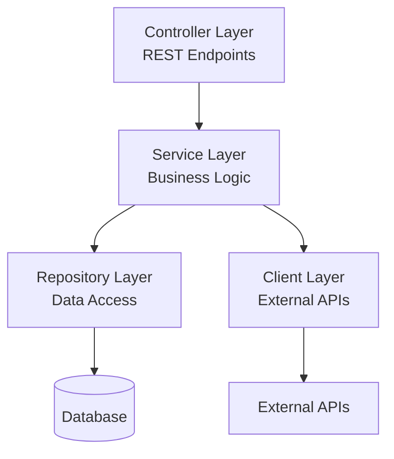
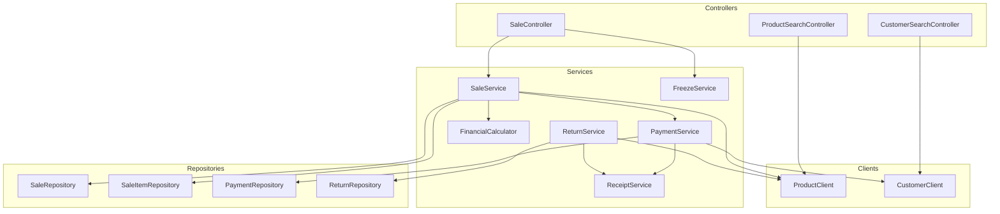

# Sales API Design Document

## Overview

The Sales API is a Spring Boot 3.x REST API that manages the complete lifecycle of supermarket point-of-sale transactions. The system orchestrates interactions between cashiers, products, customers, and payment processing while maintaining financial accuracy and data consistency.

### Core Capabilities

- **External Integration**: Communicates with Product API for catalog/stock and Customer API for credit validation
- **Transaction Management**: Handles sale creation, item management, checkout, and completion
- **Payment Processing**: Supports cash and credit payments with validation and receipt generation
- **State Management**: Manages sale lifecycle states (ACTIVE, COMPLETED, CANCELLED, FROZEN, RETURNED, PARTIALLY_RETURNED)
- **Freeze/Resume**: Allows cashiers to pause and resume sales for multi-customer scenarios
- **Return Processing**: Handles full and partial returns with stock restoration
- **Financial Accuracy**: Uses BigDecimal arithmetic with precise rounding for all monetary calculations

### Technology Stack

- **Runtime**: Java 17
- **Framework**: Spring Boot 3.x
- **Data Access**: Spring Data JPA with Hibernate
- **Database**: PostgreSQL (production), H2 (development/test)
- **HTTP Client**: RestTemplate/WebClient for external API calls
- **Validation**: Jakarta Bean Validation
- **Documentation**: SpringDoc OpenAPI (Swagger UI)
- **Testing**: JUnit 5, Mockito, Spring Boot Test, WireMock, JaCoCo

## Architecture

### System Context



### Layered Architecture

The system follows a standard Spring Boot layered architecture:



**Controller Layer**: REST endpoints, request/response DTOs, validation, HTTP status mapping

**Service Layer**: Business logic, state transitions, financial calculations, orchestration

**Repository Layer**: Spring Data JPA repositories for database operations

**Client Layer**: HTTP clients for Product API and Customer API integration

### Component Architecture



## Components and Interfaces

### REST API Endpoints

#### Sale Management

**POST /api/sales**
- Create a new sale
- Request: `CreateSaleRequest { terminalId, cashierId, customerId? }`
- Response: `SaleResponse` with status ACTIVE
- Status: 201 Created

**GET /api/sales/{saleId}**
- Retrieve sale details
- Response: `SaleResponse` with items, totals, status
- Status: 200 OK, 404 Not Found

**POST /api/sales/{saleId}/items**
- Add item to sale
- Request: `AddItemRequest { productId, quantity }`
- Response: `SaleResponse` with updated items and totals
- Status: 200 OK, 409 Conflict (insufficient stock), 422 Unprocessable Entity (invalid state)

**PUT /api/sales/{saleId}/items/{itemId}**
- Update item quantity
- Request: `UpdateItemRequest { quantity }`
- Response: `SaleResponse` with updated totals
- Status: 200 OK, 400 Bad Request, 422 Unprocessable Entity

**DELETE /api/sales/{saleId}/items/{itemId}**
- Remove item from sale
- Response: `SaleResponse` with updated totals
- Status: 200 OK, 422 Unprocessable Entity

#### Payment Processing

**POST /api/sales/{saleId}/checkout**
- Complete sale with payment
- Request: `CheckoutRequest { paymentType, amountReceived?, customerId? }`
- Response: `CheckoutResponse { transactionId, receipt, change?, creditReferenceNumber? }`
- Status: 200 OK, 409 Conflict (stock issues), 422 Unprocessable Entity (validation)

#### Sale State Management

**POST /api/sales/{saleId}/cancel**
- Cancel active or frozen sale
- Request: `CancelRequest { reason }`
- Response: `SaleResponse` with status CANCELLED
- Status: 200 OK, 422 Unprocessable Entity

**POST /api/sales/{saleId}/freeze**
- Freeze active sale
- Response: `SaleResponse` with status FROZEN
- Status: 200 OK, 422 Unprocessable Entity

**POST /api/sales/{saleId}/resume**
- Resume frozen sale
- Response: `SaleResponse` with status ACTIVE
- Status: 200 OK, 422 Unprocessable Entity

**GET /api/sales/frozen**
- List frozen sales by terminal
- Query: `terminalId`
- Response: `List<FrozenSaleResponse>`
- Status: 200 OK

#### Return Processing

**POST /api/sales/{saleId}/return**
- Process full return
- Request: `FullReturnRequest { reason }`
- Response: `ReturnResponse { returnId, returnReceipt }`
- Status: 200 OK, 422 Unprocessable Entity

**POST /api/sales/{saleId}/partial-return**
- Process partial return
- Request: `PartialReturnRequest { items: [{ productId, quantity, reason }] }`
- Response: `ReturnResponse { returnId, returnReceipt }`
- Status: 200 OK, 422 Unprocessable Entity

#### External Search

**GET /api/products/search**
- Search products via Product API
- Query: `name?`, `barcode?`
- Response: `List<ProductResponse>`
- Status: 200 OK, 502 Bad Gateway, 503 Service Unavailable

**GET /api/customers/search**
- Search customers via Customer API
- Query: `name?`, `documentNumber?`
- Response: `List<CustomerResponse>`
- Status: 200 OK, 502 Bad Gateway, 503 Service Unavailable

### Service Layer Interfaces

#### SaleService

```java
public interface SaleService {
    SaleResponse createSale(CreateSaleRequest request);
    SaleResponse getSale(Long saleId);
    SaleResponse addItem(Long saleId, AddItemRequest request);
    SaleResponse updateItem(Long saleId, Long itemId, UpdateItemRequest request);
    SaleResponse removeItem(Long saleId, Long itemId);
    void validateSaleState(Sale sale, SaleState expectedState);
    void recalculateTotals(Sale sale);
}
```

#### PaymentService

```java
public interface PaymentService {
    CheckoutResponse processCashPayment(Long saleId, BigDecimal amountReceived);
    CheckoutResponse processCreditPayment(Long saleId, Long customerId);
    void validateCheckout(Sale sale);
    void validateStockAvailability(Sale sale);
    void decrementStock(Sale sale);
}
```

#### ReturnService

```java
public interface ReturnService {
    ReturnResponse processFullReturn(Long saleId, String reason);
    ReturnResponse processPartialReturn(Long saleId, PartialReturnRequest request);
    void validateReturnEligibility(Sale sale);
    void incrementStock(List<SaleItem> items);
}
```

#### FreezeService

```java
public interface FreezeService {
    SaleResponse freezeSale(Long saleId);
    SaleResponse resumeSale(Long saleId);
    List<FrozenSaleResponse> listFrozenSales(String terminalId);
    void expireFrozenSales();
}
```

#### FinancialCalculator

```java
public interface FinancialCalculator {
    BigDecimal calculateLineTotal(BigDecimal unitPrice, int quantity);
    BigDecimal calculateSubtotal(List<SaleItem> items);
    BigDecimal calculateTax(BigDecimal subtotal, BigDecimal taxRate);
    BigDecimal calculateTotal(BigDecimal subtotal, BigDecimal tax, BigDecimal discount);
    BigDecimal calculateChange(BigDecimal amountReceived, BigDecimal total);
}
```

#### ReceiptService

```java
public interface ReceiptService {
    Receipt generateSaleReceipt(Sale sale, Payment payment);
    Receipt generateReturnReceipt(Sale originalSale, Return returnRecord);
}
```

### External Client Interfaces

#### ProductClient

```java
public interface ProductClient {
    List<ProductDTO> searchByName(String name);
    ProductDTO searchByBarcode(String barcode);
    ProductDTO getProduct(Long productId);
    void decrementStock(Long productId, int quantity);
    void incrementStock(Long productId, int quantity);
}
```

#### CustomerClient

```java
public interface CustomerClient {
    List<CustomerDTO> searchByName(String name);
    CustomerDTO searchByDocumentNumber(String documentNumber);
    CustomerDTO getCustomer(Long customerId);
}
```

## Data Models

### Domain Entities

#### Sale Entity

```java
@Entity
@Table(name = "sales")
public class Sale {
    @Id
    @GeneratedValue(strategy = GenerationType.IDENTITY)
    private Long id;
    
    @Column(nullable = false)
    private String terminalId;
    
    @Column(nullable = false)
    private String cashierId;
    
    @Column
    private Long customerId;
    
    @Enumerated(EnumType.STRING)
    @Column(nullable = false)
    private SaleState status;
    
    @OneToMany(mappedBy = "sale", cascade = CascadeType.ALL, orphanRemoval = true)
    private List<SaleItem> items = new ArrayList<>();
    
    @Column(nullable = false, precision = 10, scale = 2)
    private BigDecimal subtotal = BigDecimal.ZERO;
    
    @Column(nullable = false, precision = 10, scale = 2)
    private BigDecimal tax = BigDecimal.ZERO;
    
    @Column(nullable = false, precision = 10, scale = 2)
    private BigDecimal discount = BigDecimal.ZERO;
    
    @Column(nullable = false, precision = 10, scale = 2)
    private BigDecimal total = BigDecimal.ZERO;
    
    @Column
    private String transactionId;
    
    @Column
    private LocalDateTime createdAt;
    
    @Column
    private LocalDateTime frozenAt;
    
    @Column
    private LocalDateTime resumedAt;
    
    @Column
    private LocalDateTime completedAt;
    
    @Column
    private LocalDateTime cancelledAt;
    
    @Column(length = 255)
    private String cancellationReason;
    
    // Getters, setters, business methods
}
```

#### SaleItem Entity

```java
@Entity
@Table(name = "sale_items")
public class SaleItem {
    @Id
    @GeneratedValue(strategy = GenerationType.IDENTITY)
    private Long id;
    
    @ManyToOne(fetch = FetchType.LAZY)
    @JoinColumn(name = "sale_id", nullable = false)
    private Sale sale;
    
    @Column(nullable = false)
    private Long productId;
    
    @Column(nullable = false)
    private String productName;
    
    @Column(nullable = false, precision = 10, scale = 2)
    private BigDecimal unitPrice;
    
    @Column(nullable = false)
    private Integer quantity;
    
    @Column(nullable = false, precision = 10, scale = 2)
    private BigDecimal lineTotal;
    
    // Getters, setters
}
```

#### Payment Entity

```java
@Entity
@Table(name = "payments")
public class Payment {
    @Id
    @GeneratedValue(strategy = GenerationType.IDENTITY)
    private Long id;
    
    @OneToOne
    @JoinColumn(name = "sale_id", nullable = false)
    private Sale sale;
    
    @Enumerated(EnumType.STRING)
    @Column(nullable = false)
    private PaymentType paymentType;
    
    @Column(precision = 10, scale = 2)
    private BigDecimal amountReceived;
    
    @Column(precision = 10, scale = 2)
    private BigDecimal change;
    
    @Column
    private String creditReferenceNumber;
    
    @Column(nullable = false)
    private LocalDateTime paymentDate;
    
    // Getters, setters
}
```

#### Return Entity

```java
@Entity
@Table(name = "returns")
public class Return {
    @Id
    @GeneratedValue(strategy = GenerationType.IDENTITY)
    private Long id;
    
    @ManyToOne
    @JoinColumn(name = "original_sale_id", nullable = false)
    private Sale originalSale;
    
    @Column(nullable = false, unique = true)
    private String returnId;
    
    @Enumerated(EnumType.STRING)
    @Column(nullable = false)
    private ReturnType returnType; // FULL, PARTIAL
    
    @OneToMany(mappedBy = "returnRecord", cascade = CascadeType.ALL)
    private List<ReturnItem> items = new ArrayList<>();
    
    @Column(nullable = false)
    private LocalDateTime returnDate;
    
    // Getters, setters
}
```

#### ReturnItem Entity

```java
@Entity
@Table(name = "return_items")
public class ReturnItem {
    @Id
    @GeneratedValue(strategy = GenerationType.IDENTITY)
    private Long id;
    
    @ManyToOne
    @JoinColumn(name = "return_id", nullable = false)
    private Return returnRecord;
    
    @Column(nullable = false)
    private Long productId;
    
    @Column(nullable = false)
    private Integer quantity;
    
    @Column(nullable = false, length = 255)
    private String reason;
    
    // Getters, setters
}
```

### Enumerations

#### SaleState

```java
public enum SaleState {
    ACTIVE,           // Sale is being built
    COMPLETED,        // Sale has been paid and completed
    CANCELLED,        // Sale was cancelled
    FROZEN,           // Sale is paused
    RETURNED,         // Sale has been fully returned
    PARTIALLY_RETURNED // Sale has been partially returned
}
```

#### PaymentType

```java
public enum PaymentType {
    CASH,
    CREDIT
}
```

#### CreditStatus

```java
public enum CreditStatus {
    APPROVED,
    REJECTED,
    PENDING
}
```

#### ReturnType

```java
public enum ReturnType {
    FULL,
    PARTIAL
}
```

### Data Transfer Objects (DTOs)

#### Request DTOs

```java
public class CreateSaleRequest {
    @NotBlank
    private String terminalId;
    
    @NotBlank
    private String cashierId;
    
    private Long customerId;
}

public class AddItemRequest {
    @NotNull
    private Long productId;
    
    @Min(1)
    private Integer quantity;
}

public class UpdateItemRequest {
    @Min(1)
    private Integer quantity;
}

public class CheckoutRequest {
    @NotNull
    private PaymentType paymentType;
    
    private BigDecimal amountReceived; // Required for CASH
    
    private Long customerId; // Required for CREDIT
}

public class CancelRequest {
    @NotBlank
    @Size(max = 255)
    private String reason;
}

public class FullReturnRequest {
    @NotBlank
    @Size(max = 255)
    private String reason;
}

public class PartialReturnRequest {
    @NotEmpty
    private List<ReturnItemRequest> items;
}

public class ReturnItemRequest {
    @NotNull
    private Long productId;
    
    @Min(1)
    private Integer quantity;
    
    @NotBlank
    @Size(max = 255)
    private String reason;
}
```

#### Response DTOs

```java
public class SaleResponse {
    private Long id;
    private String terminalId;
    private String cashierId;
    private Long customerId;
    private SaleState status;
    private List<SaleItemResponse> items;
    private BigDecimal subtotal;
    private BigDecimal tax;
    private BigDecimal discount;
    private BigDecimal total;
    private String transactionId;
    private LocalDateTime createdAt;
    private LocalDateTime frozenAt;
    private LocalDateTime completedAt;
}

public class SaleItemResponse {
    private Long id;
    private Long productId;
    private String productName;
    private BigDecimal unitPrice;
    private Integer quantity;
    private BigDecimal lineTotal;
}

public class CheckoutResponse {
    private String transactionId;
    private Receipt receipt;
    private BigDecimal change;
    private String creditReferenceNumber;
}

public class ReturnResponse {
    private String returnId;
    private Receipt returnReceipt;
}

public class FrozenSaleResponse {
    private Long saleId;
    private String customerName;
    private Integer itemCount;
    private BigDecimal total;
    private LocalDateTime frozenAt;
}

public class ProductResponse {
    private Long id;
    private String name;
    private String barcode;
    private BigDecimal unitPrice;
    private Integer availableStock;
    private String category;
}

public class CustomerResponse {
    private Long id;
    private String fullName;
    private String documentType;
    private String documentNumber;
    private CreditStatus creditStatus;
}

public class Receipt {
    private String storeName;
    private String terminalId;
    private String cashierId;
    private LocalDateTime timestamp;
    private String customerInfo;
    private List<ReceiptItem> items;
    private BigDecimal subtotal;
    private BigDecimal tax;
    private BigDecimal discount;
    private BigDecimal total;
    private String paymentMethod;
    private BigDecimal amountReceived;
    private BigDecimal change;
    private String transactionId;
    private String creditReferenceNumber;
}
```

### External API DTOs

```java
public class ProductDTO {
    private Long id;
    private String name;
    private String barcode;
    private BigDecimal unitPrice;
    private Integer availableStock;
    private String category;
}

public class CustomerDTO {
    private Long id;
    private String fullName;
    private String documentType;
    private String documentNumber;
    private CreditStatus creditStatus;
}
```

### Database Schema

```sql
CREATE TABLE sales (
    id BIGSERIAL PRIMARY KEY,
    terminal_id VARCHAR(50) NOT NULL,
    cashier_id VARCHAR(50) NOT NULL,
    customer_id BIGINT,
    status VARCHAR(20) NOT NULL,
    subtotal DECIMAL(10, 2) NOT NULL DEFAULT 0.00,
    tax DECIMAL(10, 2) NOT NULL DEFAULT 0.00,
    discount DECIMAL(10, 2) NOT NULL DEFAULT 0.00,
    total DECIMAL(10, 2) NOT NULL DEFAULT 0.00,
    transaction_id VARCHAR(100),
    created_at TIMESTAMP NOT NULL,
    frozen_at TIMESTAMP,
    resumed_at TIMESTAMP,
    completed_at TIMESTAMP,
    cancelled_at TIMESTAMP,
    cancellation_reason VARCHAR(255)
);

CREATE TABLE sale_items (
    id BIGSERIAL PRIMARY KEY,
    sale_id BIGINT NOT NULL REFERENCES sales(id),
    product_id BIGINT NOT NULL,
    product_name VARCHAR(255) NOT NULL,
    unit_price DECIMAL(10, 2) NOT NULL,
    quantity INTEGER NOT NULL,
    line_total DECIMAL(10, 2) NOT NULL
);

CREATE TABLE payments (
    id BIGSERIAL PRIMARY KEY,
    sale_id BIGINT NOT NULL REFERENCES sales(id),
    payment_type VARCHAR(20) NOT NULL,
    amount_received DECIMAL(10, 2),
    change DECIMAL(10, 2),
    credit_reference_number VARCHAR(100),
    payment_date TIMESTAMP NOT NULL
);

CREATE TABLE returns (
    id BIGSERIAL PRIMARY KEY,
    original_sale_id BIGINT NOT NULL REFERENCES sales(id),
    return_id VARCHAR(100) NOT NULL UNIQUE,
    return_type VARCHAR(20) NOT NULL,
    return_date TIMESTAMP NOT NULL
);

CREATE TABLE return_items (
    id BIGSERIAL PRIMARY KEY,
    return_id BIGINT NOT NULL REFERENCES returns(id),
    product_id BIGINT NOT NULL,
    quantity INTEGER NOT NULL,
    reason VARCHAR(255) NOT NULL
);

CREATE INDEX idx_sales_status ON sales(status);
CREATE INDEX idx_sales_terminal ON sales(terminal_id);
CREATE INDEX idx_sales_transaction ON sales(transaction_id);
CREATE INDEX idx_sale_items_sale ON sale_items(sale_id);
CREATE INDEX idx_returns_sale ON returns(original_sale_id);
```


## Correctness Properties

*A property is a characteristic or behavior that should hold true across all valid executions of a system—essentially, a formal statement about what the system should do. Properties serve as the bridge between human-readable specifications and machine-verifiable correctness guarantees.*

### Property 1: Sale Creation Initializes to ACTIVE State

*For any* valid sale creation request with terminalId and cashierId, the created sale SHALL have status ACTIVE.

**Validates: Requirements 3.1**

### Property 2: Sale Creation Initializes Financial Values to Zero

*For any* valid sale creation request, the created sale SHALL have subtotal, tax, discount, and total all equal to zero with exactly 2 decimal places.

**Validates: Requirements 3.5, 6.2**

### Property 3: Sale IDs are Unique

*For any* set of created sales, all sale IDs SHALL be unique.

**Validates: Requirements 3.6**

### Property 4: Sale Creation Records Timestamp

*For any* created sale, the createdAt timestamp SHALL be non-null and within a reasonable time window of the creation request.

**Validates: Requirements 3.7**

### Property 5: Adding Item to Duplicate Product Merges Quantities

*For any* sale and product, adding the same product twice SHALL result in a single sale item with quantity equal to the sum of both additions.

**Validates: Requirements 4.2**

### Property 6: Quantity Validation Rejects Values Less Than 1

*For any* item addition or update request with quantity < 1, the operation SHALL be rejected with HTTP 400 or 422.

**Validates: Requirements 4.3, 5.2, 19.4**

### Property 7: Insufficient Stock Rejects Item Addition

*For any* product with available stock S and requested quantity Q where Q > S, the item addition SHALL be rejected with HTTP 409.

**Validates: Requirements 4.5**

### Property 8: Non-ACTIVE Sales Reject Item Modifications

*For any* sale with status other than ACTIVE, attempts to add, update, or remove items SHALL be rejected with HTTP 422.

**Validates: Requirements 4.7, 5.5**

### Property 9: Item Quantity Update Recalculates Line Total

*For any* sale item with unitPrice P and updated quantity Q, the line total SHALL equal P × Q rounded to 2 decimal places using HALF_UP.

**Validates: Requirements 5.1, 6.7**

### Property 10: Item Removal Deletes Item from Sale

*For any* sale with item I, removing I SHALL result in the sale no longer containing I.

**Validates: Requirements 5.3**

### Property 11: Subtotal Equals Sum of Line Totals

*For any* sale with items, the subtotal SHALL equal the sum of all line totals, rounded to 2 decimal places using HALF_UP.

**Validates: Requirements 6.3, 6.7**

### Property 12: Tax Equals Subtotal Times Tax Rate

*For any* sale with subtotal S and tax rate R, the tax SHALL equal S × R rounded to 2 decimal places using HALF_UP.

**Validates: Requirements 6.4, 6.7**

### Property 13: Total Equals Subtotal Plus Tax Minus Discount

*For any* sale with subtotal S, tax T, and discount D, the total SHALL equal (S + T - D) rounded to 2 decimal places using HALF_UP.

**Validates: Requirements 6.6, 6.7**

### Property 14: Cash Payment Rejects Insufficient Amount

*For any* cash payment where amountReceived < sale total, the payment SHALL be rejected with HTTP 422.

**Validates: Requirements 7.3**

### Property 15: Cash Payment Change Calculation

*For any* cash payment with amountReceived A and sale total T where A ≥ T, the change SHALL equal (A - T) rounded to 2 decimal places using HALF_UP.

**Validates: Requirements 7.4, 6.7**

### Property 16: Successful Cash Payment Transitions to COMPLETED

*For any* ACTIVE sale with valid cash payment, the sale status SHALL transition to COMPLETED.

**Validates: Requirements 7.5**

### Property 17: Cash Payment Receipt Contains Required Fields

*For any* completed cash sale, the generated receipt SHALL contain transactionId, storeName, terminalId, cashierId, timestamp, items, subtotal, tax, discount, total, paymentMethod, amountReceived, and change.

**Validates: Requirements 7.7, 18.1, 18.2**

### Property 18: Credit Payment Rejects Non-APPROVED Customers

*For any* credit payment where customer credit status is REJECTED or PENDING, the payment SHALL be rejected with HTTP 422.

**Validates: Requirements 8.4**

### Property 19: Credit Reference Numbers are Unique

*For any* set of completed credit sales, all credit reference numbers SHALL be unique.

**Validates: Requirements 8.5**

### Property 20: Successful Credit Payment Transitions to COMPLETED

*For any* ACTIVE sale with valid credit payment and APPROVED customer, the sale status SHALL transition to COMPLETED.

**Validates: Requirements 8.6**

### Property 21: Credit Payment Receipt Contains Reference Number

*For any* completed credit sale, the generated receipt SHALL contain the credit reference number.

**Validates: Requirements 8.8, 18.3**

### Property 22: Checkout Rejects Empty Sales

*For any* sale with zero items, checkout SHALL be rejected with HTTP 422.

**Validates: Requirements 9.1, 9.2**

### Property 23: Checkout Rejects Sales with Out-of-Stock Items

*For any* sale where at least one item has quantity exceeding current available stock, checkout SHALL be rejected with HTTP 409 and include the list of out-of-stock products.

**Validates: Requirements 9.5**

### Property 24: Transaction IDs are Unique

*For any* set of completed sales, all transaction IDs SHALL be unique.

**Validates: Requirements 9.6**

### Property 25: ACTIVE Sales Can Be Cancelled

*For any* sale with status ACTIVE, cancellation with a valid reason SHALL transition the status to CANCELLED.

**Validates: Requirements 10.1**

### Property 26: FROZEN Sales Can Be Cancelled

*For any* sale with status FROZEN, cancellation with a valid reason SHALL transition the status to CANCELLED.

**Validates: Requirements 10.2**

### Property 27: Cancellation Reason Length Validation

*For any* cancellation request with reason exceeding 255 characters, the request SHALL be rejected with HTTP 400.

**Validates: Requirements 10.3, 19.6**

### Property 28: Completed Sales Cannot Be Cancelled

*For any* sale with status COMPLETED, RETURNED, or PARTIALLY_RETURNED, cancellation SHALL be rejected with HTTP 422.

**Validates: Requirements 10.4**

### Property 29: Cancellation Does Not Modify Stock

*For any* sale cancellation, product stock levels SHALL remain unchanged before and after the cancellation.

**Validates: Requirements 10.5**

### Property 30: Cancellation Records Timestamp and Reason

*For any* cancelled sale, the cancelledAt timestamp and cancellationReason SHALL be non-null.

**Validates: Requirements 10.6**

### Property 31: ACTIVE Sales Can Be Frozen

*For any* sale with status ACTIVE, freezing SHALL transition the status to FROZEN.

**Validates: Requirements 11.1**

### Property 32: Freezing Records Timestamp

*For any* frozen sale, the frozenAt timestamp SHALL be non-null.

**Validates: Requirements 11.2**

### Property 33: Freezing Preserves Sale Data

*For any* sale, the items and financial totals before freezing SHALL be identical to those after freezing.

**Validates: Requirements 11.3**

### Property 34: Non-ACTIVE Sales Cannot Be Frozen

*For any* sale with status other than ACTIVE, freezing SHALL be rejected with HTTP 422.

**Validates: Requirements 11.4**

### Property 35: Freeze-Resume Round Trip Restores ACTIVE State

*For any* ACTIVE sale, freezing then immediately resuming SHALL result in status ACTIVE.

**Validates: Requirements 12.1**

### Property 36: Resume Preserves Sale Data

*For any* sale, the items and financial totals before freezing SHALL be identical to those after resuming.

**Validates: Requirements 12.2**

### Property 37: Non-FROZEN Sales Cannot Be Resumed

*For any* sale with status other than FROZEN, resuming SHALL be rejected with HTTP 422.

**Validates: Requirements 12.3**

### Property 38: Resume Records Timestamp

*For any* resumed sale, the resumedAt timestamp SHALL be non-null.

**Validates: Requirements 12.4**

### Property 39: Frozen Sales Query Filters by Terminal and Status

*For any* terminal ID, querying frozen sales SHALL return only sales with status FROZEN and matching terminalId.

**Validates: Requirements 13.1**

### Property 40: Frozen Sales Response Contains Required Fields

*For any* frozen sale in the query result, the response SHALL contain saleId, customerName (if present), itemCount, total, and frozenAt.

**Validates: Requirements 13.2**

### Property 41: Frozen Sales Ordered by Timestamp Descending

*For any* list of frozen sales, they SHALL be ordered by frozenAt in descending order (most recent first).

**Validates: Requirements 13.3**

### Property 42: Expired Frozen Sales Auto-Cancel

*For any* frozen sale where (current time - frozenAt) > expiration timeout, the sale SHALL be automatically cancelled with reason "Frozen sale expired".

**Validates: Requirements 14.2, 14.3**

### Property 43: COMPLETED Sales Can Be Fully Returned

*For any* sale with status COMPLETED, full return with valid reason SHALL transition the status to RETURNED.

**Validates: Requirements 15.1**

### Property 44: Return Reason Length Validation

*For any* return request with reason exceeding 255 characters, the request SHALL be rejected with HTTP 400.

**Validates: Requirements 15.2, 19.6**

### Property 45: Full Return Receipt References Original Transaction

*For any* full return, the generated return receipt SHALL contain the original sale's transaction ID.

**Validates: Requirements 15.4, 18.4**

### Property 46: Non-COMPLETED Sales Cannot Be Fully Returned

*For any* sale with status other than COMPLETED, full return SHALL be rejected with HTTP 422.

**Validates: Requirements 15.5**

### Property 47: Full Return Records Timestamp and Reason

*For any* full return, the return record SHALL have non-null returnDate and reason.

**Validates: Requirements 15.6**

### Property 48: COMPLETED Sales Can Be Partially Returned

*For any* sale with status COMPLETED, partial return with valid items SHALL transition the status to PARTIALLY_RETURNED.

**Validates: Requirements 16.1**

### Property 49: Multiple Partial Returns Are Allowed

*For any* sale with status PARTIALLY_RETURNED, additional partial returns with valid items SHALL succeed.

**Validates: Requirements 16.2**

### Property 50: Partial Return Rejects Excessive Quantities

*For any* sale item with purchased quantity P and previously returned quantity R, attempting to return quantity Q where Q > (P - R) SHALL be rejected with HTTP 422.

**Validates: Requirements 16.4**

### Property 51: Partial Return Receipt Contains Only Returned Items

*For any* partial return, the generated return receipt SHALL contain only the items specified in the return request.

**Validates: Requirements 16.6, 18.5**

### Property 52: Partial Return Records Per-Item Metadata

*For any* partial return, each returned item SHALL have non-null returnDate and reason.

**Validates: Requirements 16.7**

### Property 53: Only COMPLETED and PARTIALLY_RETURNED Sales Can Be Returned

*For any* sale with status other than COMPLETED or PARTIALLY_RETURNED, return requests SHALL be rejected with HTTP 422.

**Validates: Requirements 17.1**

### Property 54: RETURNED Sales Cannot Be Returned Again

*For any* sale with status RETURNED, return requests SHALL be rejected with HTTP 422.

**Validates: Requirements 17.2**

### Property 55: Credit Sale Returns Generate Credit Notes

*For any* sale completed with credit payment, the return receipt SHALL indicate credit note (not cash refund).

**Validates: Requirements 17.3**

### Property 56: Cash Sale Returns Indicate Cash Refund

*For any* sale completed with cash payment, the return receipt SHALL indicate cash refund.

**Validates: Requirements 17.4**

### Property 57: Return IDs are Unique

*For any* set of return transactions, all return IDs SHALL be unique.

**Validates: Requirements 17.5**

### Property 58: Monetary Values are Non-Negative

*For any* request containing monetary values (unitPrice, amountReceived, discount), negative values SHALL be rejected with HTTP 400.

**Validates: Requirements 19.5**


## Error Handling

### Global Exception Handler

The system uses a centralized `@RestControllerAdvice` exception handler that maps exceptions to appropriate HTTP responses:

```java
@RestControllerAdvice
public class GlobalExceptionHandler {
    
    @ExceptionHandler(MethodArgumentNotValidException.class)
    public ResponseEntity<ErrorResponse> handleValidationErrors(MethodArgumentNotValidException ex);
    
    @ExceptionHandler(IllegalStateException.class)
    public ResponseEntity<ErrorResponse> handleIllegalState(IllegalStateException ex);
    
    @ExceptionHandler(InsufficientStockException.class)
    public ResponseEntity<ErrorResponse> handleInsufficientStock(InsufficientStockException ex);
    
    @ExceptionHandler(ServiceUnavailableException.class)
    public ResponseEntity<ErrorResponse> handleServiceUnavailable(ServiceUnavailableException ex);
    
    @ExceptionHandler(ServiceErrorException.class)
    public ResponseEntity<ErrorResponse> handleServiceError(ServiceErrorException ex);
    
    @ExceptionHandler(EntityNotFoundException.class)
    public ResponseEntity<ErrorResponse> handleNotFound(EntityNotFoundException ex);
    
    @ExceptionHandler(Exception.class)
    public ResponseEntity<ErrorResponse> handleGenericException(Exception ex);
}
```

### Error Response Format

```java
public class ErrorResponse {
    private LocalDateTime timestamp;
    private int status;
    private String error;
    private String message;
    private String path;
    private Map<String, String> validationErrors; // For validation failures
}
```

### HTTP Status Code Mapping

| Exception Type | HTTP Status | Use Case |
|---------------|-------------|----------|
| `MethodArgumentNotValidException` | 400 Bad Request | Bean validation failures (null required fields, invalid formats) |
| `IllegalArgumentException` | 400 Bad Request | Invalid method arguments |
| `IllegalStateException` | 422 Unprocessable Entity | Business rule violations (invalid state transitions, insufficient payment) |
| `InsufficientStockException` | 409 Conflict | Stock availability conflicts |
| `EntityNotFoundException` | 404 Not Found | Sale, item, or resource not found |
| `ServiceUnavailableException` | 503 Service Unavailable | External API connection failures (Product API, Customer API) |
| `ServiceErrorException` | 502 Bad Gateway | External API error responses |
| `Exception` (generic) | 500 Internal Server Error | Unexpected errors |

### Custom Exceptions

```java
public class InsufficientStockException extends RuntimeException {
    private List<String> outOfStockProducts;
}

public class ServiceUnavailableException extends RuntimeException {
    private String serviceName;
}

public class ServiceErrorException extends RuntimeException {
    private String serviceName;
}
```

### External API Error Handling

**Product API Client:**
- Connection timeout/refused → `ServiceUnavailableException("Product service unavailable")`
- HTTP 4xx/5xx responses → `ServiceErrorException("Product service error")`
- Successful responses → Parse and return data

**Customer API Client:**
- Connection timeout/refused → `ServiceUnavailableException("Customer service unavailable")`
- HTTP 4xx/5xx responses → `ServiceErrorException("Customer service error")`
- Successful responses → Parse and return data

### Validation Error Messages

Bean validation annotations provide field-level error messages:

```java
@NotBlank(message = "Terminal ID is required")
private String terminalId;

@Min(value = 1, message = "Quantity must be at least 1")
private Integer quantity;

@Size(max = 255, message = "Reason must not exceed 255 characters")
private String reason;
```

### Logging Strategy

- **INFO**: Successful operations (sale created, payment processed, return completed)
- **WARN**: Business rule violations (insufficient stock, invalid state transitions)
- **ERROR**: External service failures, unexpected exceptions
- **DEBUG**: External API request/response details

## Testing Strategy

### Overview

The testing strategy employs a dual approach combining property-based testing for universal correctness properties with example-based unit and integration tests for specific scenarios and external integrations.

### Property-Based Testing

**Framework**: Use **jqwik** (Java property-based testing library) for implementing correctness properties.

**Configuration**:
- Minimum 100 iterations per property test (configured via `@Property(tries = 100)`)
- Each property test references its design document property via comment tag
- Tag format: `// Feature: sales-api, Property {number}: {property_text}`

**Test Organization**:
```
src/test/java/
  com/supermarket/sales/
    properties/
      SaleCreationProperties.java
      ItemManagementProperties.java
      FinancialCalculationProperties.java
      PaymentProcessingProperties.java
      StateTransitionProperties.java
      FreezeResumeProperties.java
      ReturnProcessingProperties.java
      ValidationProperties.java
```

**Example Property Test**:
```java
@Property(tries = 100)
// Feature: sales-api, Property 11: Subtotal Equals Sum of Line Totals
void subtotalEqualsSumOfLineTotals(
    @ForAll @Size(min = 1, max = 10) List<@From("saleItems") SaleItem> items) {
    
    Sale sale = new Sale();
    items.forEach(sale::addItem);
    
    financialCalculator.recalculateTotals(sale);
    
    BigDecimal expectedSubtotal = items.stream()
        .map(SaleItem::getLineTotal)
        .reduce(BigDecimal.ZERO, BigDecimal::add)
        .setScale(2, RoundingMode.HALF_UP);
    
    assertThat(sale.getSubtotal()).isEqualByComparingTo(expectedSubtotal);
}

@Provide
Arbitrary<SaleItem> saleItems() {
    return Combinators.combine(
        Arbitraries.longs().between(1L, 10000L),
        Arbitraries.strings().alpha().ofLength(10),
        Arbitraries.bigDecimals()
            .between(BigDecimal.valueOf(0.01), BigDecimal.valueOf(1000.00))
            .ofScale(2),
        Arbitraries.integers().between(1, 100)
    ).as((productId, name, price, qty) -> {
        SaleItem item = new SaleItem();
        item.setProductId(productId);
        item.setProductName(name);
        item.setUnitPrice(price);
        item.setQuantity(qty);
        item.setLineTotal(price.multiply(BigDecimal.valueOf(qty))
            .setScale(2, RoundingMode.HALF_UP));
        return item;
    });
}
```

**Generators (Arbitraries)**:
- `CreateSaleRequest`: random terminalId, cashierId, optional customerId
- `SaleItem`: random productId, name, unitPrice (0.01-1000.00), quantity (1-100)
- `Sale`: random items (1-10), calculated totals
- `PaymentType`: CASH or CREDIT
- `SaleState`: all enum values
- `BigDecimal`: monetary values with 2 decimal places

### Unit Testing

**Framework**: JUnit 5 + Mockito + AssertJ

**Scope**: Service layer business logic in isolation

**Mock Strategy**:
- Mock all repositories (`SaleRepository`, `SaleItemRepository`, etc.)
- Mock external clients (`ProductClient`, `CustomerClient`)
- Mock `FinancialCalculator` when testing orchestration logic
- Use real `FinancialCalculator` when testing calculation logic

**Test Classes**:
```
src/test/java/
  com/supermarket/sales/
    service/
      SaleServiceTest.java
      PaymentServiceTest.java
      ReturnServiceTest.java
      FreezeServiceTest.java
      FinancialCalculatorTest.java
      ReceiptServiceTest.java
```

**Coverage Target**: Minimum 90% line coverage for service layer

**Example Unit Test**:
```java
@ExtendWith(MockitoExtension.class)
class PaymentServiceTest {
    
    @Mock
    private SaleRepository saleRepository;
    
    @Mock
    private ProductClient productClient;
    
    @Mock
    private CustomerClient customerClient;
    
    @Mock
    private ReceiptService receiptService;
    
    @InjectMocks
    private PaymentService paymentService;
    
    @Test
    void processCashPayment_withSufficientAmount_completesSale() {
        // Given
        Sale sale = createActiveSaleWithItems();
        BigDecimal amountReceived = BigDecimal.valueOf(100.00);
        
        when(saleRepository.findById(1L)).thenReturn(Optional.of(sale));
        when(saleRepository.save(any())).thenReturn(sale);
        
        // When
        CheckoutResponse response = paymentService.processCashPayment(1L, amountReceived);
        
        // Then
        assertThat(sale.getStatus()).isEqualTo(SaleState.COMPLETED);
        assertThat(response.getChange()).isEqualByComparingTo(
            amountReceived.subtract(sale.getTotal()));
        verify(productClient, times(sale.getItems().size())).decrementStock(anyLong(), anyInt());
    }
    
    @Test
    void processCashPayment_withInsufficientAmount_throwsException() {
        // Given
        Sale sale = createActiveSaleWithTotal(BigDecimal.valueOf(100.00));
        BigDecimal amountReceived = BigDecimal.valueOf(50.00);
        
        when(saleRepository.findById(1L)).thenReturn(Optional.of(sale));
        
        // When/Then
        assertThatThrownBy(() -> paymentService.processCashPayment(1L, amountReceived))
            .isInstanceOf(IllegalStateException.class)
            .hasMessage("Amount received is less than sale total");
    }
}
```

### Integration Testing

**Framework**: Spring Boot Test + H2 Database + WireMock

**Scope**: End-to-end workflows with real database and mocked external APIs

**Configuration**:
```java
@SpringBootTest(webEnvironment = WebEnvironment.RANDOM_PORT)
@AutoConfigureMockMvc
@ActiveProfiles("test")
@DirtiesContext(classMode = ClassMode.AFTER_EACH_TEST_METHOD)
class SalesIntegrationTest {
    
    @Autowired
    private MockMvc mockMvc;
    
    @Autowired
    private SaleRepository saleRepository;
    
    private WireMockServer wireMockServer;
    
    @BeforeEach
    void setup() {
        wireMockServer = new WireMockServer(8089);
        wireMockServer.start();
        configureFor("localhost", 8089);
    }
    
    @AfterEach
    void teardown() {
        wireMockServer.stop();
    }
}
```

**Test Scenarios**:

1. **Complete Cash Sale Workflow**
   - Create sale → Add items → Checkout with cash → Verify completion
   - Verify stock decrement calls to Product API
   - Verify receipt generation

2. **Complete Credit Sale Workflow**
   - Create sale with customer → Add items → Checkout with credit
   - Mock Customer API credit validation (APPROVED)
   - Verify completion and credit reference number

3. **Freeze and Resume Workflow**
   - Create sale → Add items → Freeze → List frozen sales → Resume → Complete

4. **Full Return Workflow**
   - Complete sale → Process full return
   - Verify stock increment calls to Product API
   - Verify return receipt generation

5. **Partial Return Workflow**
   - Complete sale with multiple items → Return subset of items
   - Verify partial stock increment
   - Verify status transition to PARTIALLY_RETURNED

6. **Sale Cancellation Workflow**
   - Create sale → Add items → Cancel
   - Verify no stock changes

7. **Stock Validation Failure**
   - Create sale → Add item with insufficient stock
   - Mock Product API to return low stock
   - Verify HTTP 409 response

8. **Credit Validation Failure**
   - Create sale → Attempt credit checkout with REJECTED customer
   - Mock Customer API to return REJECTED status
   - Verify HTTP 422 response

9. **External Service Unavailable**
   - Attempt product search with Product API down
   - Verify HTTP 503 response

**Coverage Target**: Minimum 80% line coverage across entire project

### Test Coverage Reporting

**Tool**: JaCoCo Maven Plugin

**Configuration** (pom.xml):
```xml
<plugin>
    <groupId>org.jacoco</groupId>
    <artifactId>jacoco-maven-plugin</artifactId>
    <version>0.8.10</version>
    <executions>
        <execution>
            <goals>
                <goal>prepare-agent</goal>
            </goals>
        </execution>
        <execution>
            <id>report</id>
            <phase>test</phase>
            <goals>
                <goal>report</goal>
            </goals>
        </execution>
        <execution>
            <id>check</id>
            <goals>
                <goal>check</goal>
            </goals>
            <configuration>
                <rules>
                    <rule>
                        <element>BUNDLE</element>
                        <limits>
                            <limit>
                                <counter>LINE</counter>
                                <value>COVEREDRATIO</value>
                                <minimum>0.80</minimum>
                            </limit>
                        </limits>
                    </rule>
                </rules>
            </configuration>
        </execution>
    </executions>
    <configuration>
        <excludes>
            <exclude>**/config/**</exclude>
            <exclude>**/dto/**</exclude>
            <exclude>**/Application.class</exclude>
        </excludes>
    </configuration>
</plugin>
```

**Report Location**: `target/site/jacoco/index.html`

**Build Failure**: Build fails if coverage drops below 80%

### Test Execution

**Run all tests**:
```bash
mvn clean test
```

**Run only unit tests**:
```bash
mvn test -Dtest="*Test"
```

**Run only integration tests**:
```bash
mvn test -Dtest="*IntegrationTest"
```

**Run only property tests**:
```bash
mvn test -Dtest="*Properties"
```

**Generate coverage report**:
```bash
mvn clean test jacoco:report
```

### Continuous Integration

**Pre-commit checks**:
- Run all tests
- Verify coverage meets 80% threshold
- Run static analysis (Checkstyle, SpotBugs)

**CI Pipeline** (GitHub Actions / Jenkins):
1. Build project
2. Run unit tests
3. Run property-based tests
4. Run integration tests
5. Generate coverage report
6. Fail build if coverage < 80%
7. Publish test results and coverage report

